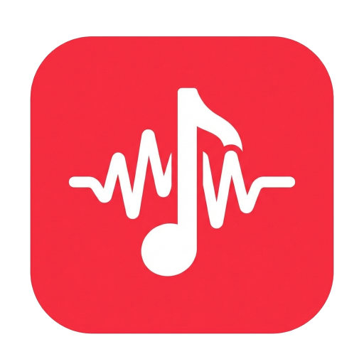

# 🎵 AudioMab

> An Apple Music-inspired YouTube audio streaming PWA

<p align="center">
  
</p>

<p align="center">
  <strong>Stream YouTube audio with style</strong>
</p>

<p align="center">
  <a href="https://audio-mab.vercel.app">
    
  </a>
</p>

<p align="center">
  <a href="https://x.com/berlyoge">
    
  </a>
  <a href="https://github.com/Poissac9/AudioMab/stargazers">
    
  </a>
  <a href="https://github.com/Poissac9/AudioMab">
    
  </a>
</p>

---

## ⚠️ Important Disclaimer

> **This project is for educational and personal use only.**

This project uses [yt-dlp](https://github.com/yt-dlp/yt-dlp) to extract audio from YouTube. Please be aware:

- **YouTube Terms of Service**: Downloading or streaming content from YouTube without explicit permission may violate [YouTube's Terms of Service](https://www.youtube.com/t/terms).
- **No Commercial Use**: This project must **NOT** be used for commercial purposes. Doing so violates Google's policies and potentially copyright laws.
- **Copyright**: Respect content creators' rights. Do not redistribute or claim ownership of downloaded content.
- **Personal Responsibility**: The author(s) of this project are **NOT responsible** for how you use this software. Use at your own risk.

**By using this software, you agree to comply with all applicable laws and terms of service.**

---

## ✨ Features

- 🎨 **Apple Music-inspired UI** - Beautiful, modern design with glassmorphism effects
- 🌙 **Dark/Light/Auto themes** - Seamless theme switching
- 📱 **PWA Support** - Install as an app, works offline with cached audio
- 🔍 **YouTube Search** - Search for any song, artist, or genre
- 📋 **Playlist Import** - Import YouTube playlists
- 🍎 **Apple Music Import** - Import playlists from Apple Music (experimental)
- 💾 **Offline Mode** - Download tracks for offline listening
- ❤️ **Favorites** - Save your favorite songs
- 📜 **Lyrics** - Synchronized lyrics via lrclib.net
- 🎚️ **Full Controls** - Play, pause, skip, shuffle, repeat, queue management
- 📲 **Share Target** - Share links directly to the app

---

## 🚀 Getting Started

### Prerequisites

- Node.js 18+ 
- npm or yarn
- Python 3 and yt-dlp (for local backend testing)
- A server to deploy to (e.g., Netcup + Coolify)

### Project Structure

```
AudioMab/
├── src/                    # Next.js unified full-stack app
│   ├── app/               # App router pages & API Routes
│   ├── components/        # React components
│   └── context/           # React context providers
├── public/                 # Static assets
└── ...
```

### Local Development

1. **Clone the repository**
   ```bash
   git clone https://github.com/Poissac9/AudioMab.git
   cd AudioMab
   ```

2. **Install dependencies**
   ```bash
   npm install
   ```

3. **Native Backend Setup**
   The application now includes the former yt-dlp backend directly in the Next.js API routes! 
   Make sure you have `yt-dlp` installed on your machine so the local API can execute it.

4. **Run the development server**
   ```bash
   npm run dev
   ```

6. **Open your browser**
   
   Navigate to [http://localhost:3000](http://localhost:3000)

---

## 🌐 Deployment (Coolify)

The project is now a unified Next.js application with a multi-stage Dockerfile that installs `yt-dlp` natively alongside your frontend.

1. Push your code to GitHub
2. In your Coolify dashboard, create a new resource from your GitHub repository.
3. Select Dockerfile-based deployment (Coolify will detect the `Dockerfile` in the root).
4. Deploy! Next.js and the yt-dlp API routes run seamlessly together on port 3000.

---

**Tech Stack:**
- [Next.js 14](https://nextjs.org/) - React framework & API Routes
- [Framer Motion](https://www.framer.com/motion/) - Animations
- [Lucide React](https://lucide.dev/) - Icons
- [yt-dlp](https://github.com/yt-dlp/yt-dlp) - YouTube extraction
- Docker - Deployment containerization

---

## 📱 PWA Features

AudioMab is a Progressive Web App that can be installed on your device:

- **Install on iOS**: Open in Safari → Share → Add to Home Screen
- **Install on Android**: Open in Chrome → Menu → Install app
- **Install on Desktop**: Click the install icon in the address bar

### Offline Support

Downloaded tracks are cached and available offline. The app shell is also cached for offline access.

---

## 🤝 Contributing

Contributions are welcome! Please:

1. Fork the repository
2. Create a feature branch (`git checkout -b feature/amazing-feature`)
3. Commit your changes (`git commit -m 'Add amazing feature'`)
4. Push to the branch (`git push origin feature/amazing-feature`)
5. Open a Pull Request

---

## 📜 License

This project is open source and available under the [MIT License](LICENSE).

---

## 👤 Author

**Berly Oge**

- Twitter: [@berlyoge](https://x.com/berlyoge)
- GitHub: [@Poissac9](https://github.com/Poissac9)

<a href="https://x.com/berlyoge">
  
</a>

---

## ⚖️ Legal Notice

This software is provided "as is", without warranty of any kind. The authors are not responsible for any misuse of this software. Users are solely responsible for ensuring their use complies with:

- YouTube's Terms of Service
- Google's API Terms of Service
- Applicable copyright laws in their jurisdiction
- Any other relevant laws and regulations

**Do not use this software for commercial purposes.**

---

<p align="center">
  Made with ❤️ for music lovers
</p>
